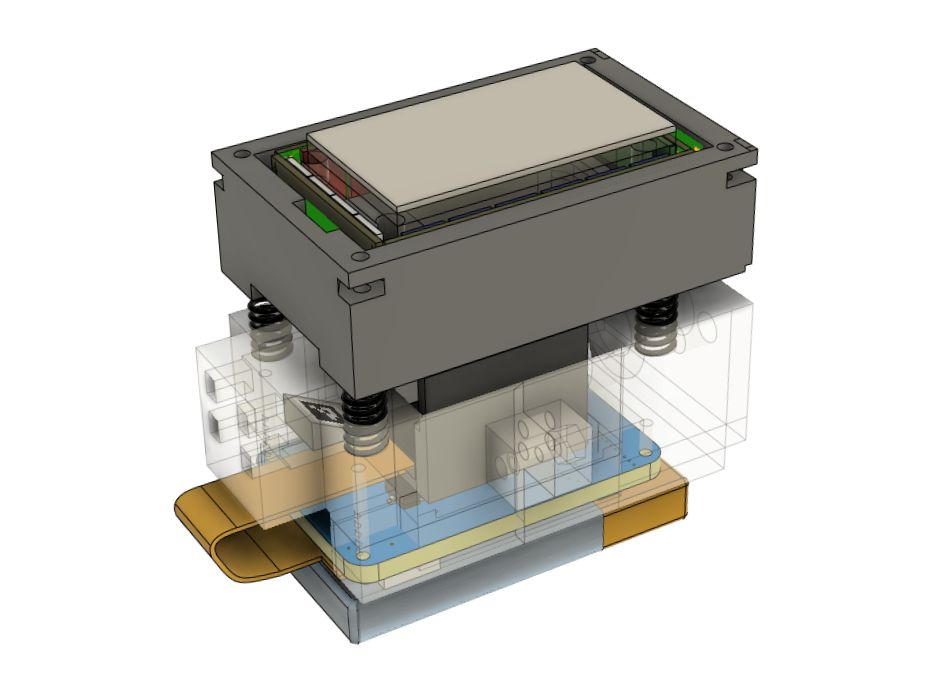

L3 F-TOUCH Design
=================

<p align="center">
  
</p>

L3 F-TOUCH sensor is an enhanced version of the GelSight sensor, it acquires a much better three-axis force sensing capability while being ***L***ight-weight, ***L***ow-cost and wire***L***ess for the ease of replication and deployment.

We decouple the three-axis force and tactile information using a suspension structure with mirrored visual tag. The L3 F-TOUCH demonstrates an improved force sensing capability immuned from contact geometry compared to other GelSight-like designs while being light and cost-effective compared to commercial three-axis force sensors. The wireless data transmission feature also enables broader applications of akin vision-based tactile sensors. 

This repository contains the documentation and manufacturing files for L3 F-TOUCH tactile sensor.

Manufacturing
-------------

* The 3D design files and BOM are in [prototype](prototype/);
* The wireless camera module design is in [PCB](PCB/);

Running
-----------

* Compile and upload the [firmware](/firmware) via [PlatformIO](https://github.com/platformio/platformio-vscode-ide) (WiFi must be configured);
* Use [VLC](https://github.com/videolan/vlc) to check the RTSP video streaming. Adress can be found in Serial monitor when startup.
* Run [L3-FTOUCH.py](/software/L3-FTOUCH.py) for demonstration;

Remarks
-----------
* Modify the firmware to use picture mode for higher quality images (advanced).

Video
-----------

[](https://www.youtube.com/watch?v=NIsbJhs_ChQ "L3 F-TOUCH: A Wireless GelSight with Decoupled Tactile and Three-axis Force Sensing")

Citation
-----------
If you use this project in your research, please cite:

```BibTeX
@article{li20233,
  title={L$^3$ F-TOUCH: A Wireless GelSight with Decoupled Tactile and Three-axis Force Sensing},
  author={Li, Wanlin and Wang, Meng and Li, Jiarui and Su, Yao and Jha, Devesh K and Qian, Xinyuan and Althoefer, Kaspar and Liu, Hangxin},
  journal={IEEE Robotics and Automation Letters},
  volume={8},
  number={8},
  pages={5148--5155},
  year={2023},
  publisher={IEEE}
}
```


