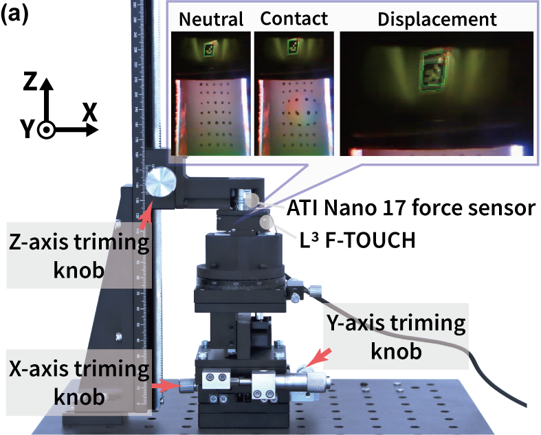

  

* For the Tactile Mode, you can use any vision-based tactile sensor (VBTS) technique, for instance, GelSight, GelSlim etc.
* For the Force Mode, you can also use any AR tag. Here we use ArUco marker and collected the groundtruth data from the ATI F/T sensor and the L3-FTOUCH sensor data using the setup shown above. Please make sure that the two data are synchronized and saved, for instance, in a csv file. Then run ForceCalibration3by3.py to generate the calibration matrix forcematrix.npy. An example of the predicted data is presented in Linearity.mat. The complete version with user interface is L3-FTOUCH.py. 
